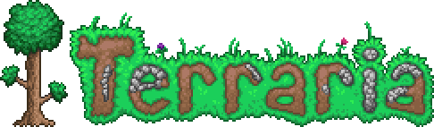

# docker-terraria-server

[![Official Size]](https://hub.docker.com/r/dstmodders/terraria-server)
[![TShock Size]](https://hub.docker.com/r/dstmodders/terraria-server)
[![CI]](https://github.com/dstmodders/docker-terraria-server/actions/workflows/ci.yml)
[![Build]](https://github.com/dstmodders/docker-terraria-server/actions/workflows/build.yml)



## Supported tags and respective `Dockerfile` links

- [`1.4.4.9-official`, `1.4.4.9`, `official`, `latest`](https://github.com/dstmodders/docker-terraria-server/blob/981ccec24188ce42c4fa5c71e103843c0d900c6d/official/Dockerfile)
- [`1.4.4.9-tshock-5.2.0`, `1.4.4.9-tshock`, `tshock-5.2.0`, `5.2.0`, `tshock`](https://github.com/dstmodders/docker-terraria-server/blob/981ccec24188ce42c4fa5c71e103843c0d900c6d/tshock/Dockerfile)

## Overview

[Docker] images for the [Terraria] game servers, including official and
community [TShock] variants, emphasizing pure vanilla experience by default.

- [Quickstart](#quickstart)
- [Usage](#usage)
- [Supported environment variables](#supported-environment-variables)
- [Supported architectures](#supported-architectures)
- [Supported build arguments](#supported-build-arguments)
- [Build](#build)

## Quickstart

To begin, the simplest method is to clone this repository and execute
[Docker Compose] from within either the `official` or `tshock` directory. This
will automatically handle the pulling, creation, and mounting of all necessary
components for you:

### Step 1/4. Clone the repository and move into the corresponding directory

For [Official] server:

```shell
$ git clone https://github.com/dstmodders/docker-terraria-server.git
$ cd ./docker-terraria-server/official/
```

For [TShock] server:

```shell
$ git clone https://github.com/dstmodders/docker-terraria-server.git
$ cd ./docker-terraria-server/tshock/
```

### Step 2/4. Start the server

```shell
$ docker compose up
```

All the server data, including the world and server settings, will be stored
within the `./data/` directory.

### Step 3/4. Attach to send server commands

```shell
$ docker compose attach terraria
```

> [!TIP]
> To detach, use <kbd>CTRL</kbd> + <kbd>P</kbd> and then <kbd>CTRL</kbd> +
> <kbd>Q</kbd>.

### Step 4/4. Stop the server

```shell
$ docker compose down
```

Once you've tested everything successfully, you can move the example
`./docker-compose.yml` into any directory of your choice and edit it according
to your specific needs. Remember to also move the `./data/` directory if you
wish to preserve your existing world and server settings.

For more detailed usage instructions, continue reading the next [Usage](#usage)
chapter.

## Usage

- [Official]
- [TShock]

### Official

> [!IMPORTANT]
> By default, the official [Terraria] server stores worlds in
> `/home/terraria/.local/share/Terraria/Worlds/`. We have changed the default
> path to `/data/worlds/` instead to simplify the mounting process.

- [Docker Run (official)](#docker-run-official)
- [Docker Compose (official)](#docker-compose-official)

#### Docker Run (official)

To pull the latest official server:

```shell
$ docker pull dstmodders/terraria-server:latest
# or
$ docker pull ghcr.io/dstmodders/terraria-server:latest
```

> [!TIP]
> See [tags] for a list of all available versions.

##### Shell/Bash (Linux & macOS)

```shell
$ docker run --rm -it -v "$(pwd):/data/" -p 7777:7777 dstmodders/terraria-server
```

<details>
<summary><b>The same, but with default environment variables</b></summary>
<p><pre>$ docker run --rm -it -v "$(pwd):/data/" -p 7777:7777 \
    -e DEBUG_ENTRYPOINT=0 \
    -e DISABLE_COLORS=0 \
    -e DISABLE_SUMMARY=0 \
    -e TZ=UTC \
    -e TERRARIA_AUTOCREATE=3 \
    -e TERRARIA_BANLIST=/data/banlist.txt \
    -e TERRARIA_DIFFICULTY=0 \
    -e TERRARIA_LANGUAGE='en-US' \
    -e TERRARIA_MAXPLAYERS=8 \
    -e TERRARIA_MOTD="Please don't cut the purple trees!" \
    -e TERRARIA_NPCSTREAM=60 \
    -e TERRARIA_PASSWORD='' \
    -e TERRARIA_PORT=7777 \
    -e TERRARIA_PRIORITY=1 \
    -e TERRARIA_SECURE=1 \
    -e TERRARIA_SEED='' \
    -e TERRARIA_UPNP=1 \
    -e TERRARIA_WORLD=/data/worlds/World.wld \
    -e TERRARIA_WORLDNAME=World \
    -e TERRARIA_WORLDPATH=/data/worlds/ \
    -e TERRARIA_JOURNEYPERMISSION_BIOMESPREAD_SETFROZEN=2 \
    -e TERRARIA_JOURNEYPERMISSION_GODMODE=2 \
    -e TERRARIA_JOURNEYPERMISSION_INCREASEPLACEMENTRANGE=2 \
    -e TERRARIA_JOURNEYPERMISSION_RAIN_SETFROZEN=2 \
    -e TERRARIA_JOURNEYPERMISSION_RAIN_SETSTRENGTH=2 \
    -e TERRARIA_JOURNEYPERMISSION_SETDIFFICULTY=2 \
    -e TERRARIA_JOURNEYPERMISSION_SETSPAWNRATE=2 \
    -e TERRARIA_JOURNEYPERMISSION_TIME_SETDAWN=2 \
    -e TERRARIA_JOURNEYPERMISSION_TIME_SETDUSK=2 \
    -e TERRARIA_JOURNEYPERMISSION_TIME_SETFROZEN=2 \
    -e TERRARIA_JOURNEYPERMISSION_TIME_SETMIDNIGHT=2 \
    -e TERRARIA_JOURNEYPERMISSION_TIME_SETNOON=2 \
    -e TERRARIA_JOURNEYPERMISSION_TIME_SETSPEED=2 \
    -e TERRARIA_JOURNEYPERMISSION_WIND_SETFROZEN=2 \
    -e TERRARIA_JOURNEYPERMISSION_WIND_SETSTRENGTH=2 \
    -e TERRARIA_ANNOUNCEMENTBOXRANGE='' \
    -e TERRARIA_CONFIG=/data/config.txt \
    -e TERRARIA_DISABLEANNOUNCEMENTBOX='' \
    -e TERRARIA_FORCEPRIORITY='' \
    -e TERRARIA_IP='' \
    -e TERRARIA_LOBBY='' \
    -e TERRARIA_STEAM=0 \
    dstmodders/terraria-server</pre></p>
</details>

##### CMD (Windows)

```cmd
> docker run --rm -it -v "%CD%:/data/" -p 7777:7777 dstmodders/terraria-server
```

<details>
<summary><b>The same, but with default environment variables</b></summary>
<p><pre>> docker run --rm -it -v "%CD%:/data/" -p 7777:7777 ^
    -e DEBUG_ENTRYPOINT=0 ^
    -e DISABLE_COLORS=0 ^
    -e DISABLE_SUMMARY=0 ^
    -e TZ=UTC ^
    -e TERRARIA_AUTOCREATE=3 ^
    -e TERRARIA_BANLIST=/data/banlist.txt ^
    -e TERRARIA_DIFFICULTY=0 ^
    -e TERRARIA_LANGUAGE="en-US" ^
    -e TERRARIA_MAXPLAYERS=8 ^
    -e TERRARIA_MOTD="Please don't cut the purple trees!" ^
    -e TERRARIA_NPCSTREAM=60 ^
    -e TERRARIA_PASSWORD="" ^
    -e TERRARIA_PORT=7777 ^
    -e TERRARIA_PRIORITY=1 ^
    -e TERRARIA_SECURE=1 ^
    -e TERRARIA_SEED="" ^
    -e TERRARIA_UPNP=1 ^
    -e TERRARIA_WORLD=/data/worlds/World.wld ^
    -e TERRARIA_WORLDNAME=World ^
    -e TERRARIA_WORLDPATH=/data/worlds/ ^
    -e TERRARIA_JOURNEYPERMISSION_BIOMESPREAD_SETFROZEN=2 ^
    -e TERRARIA_JOURNEYPERMISSION_GODMODE=2 ^
    -e TERRARIA_JOURNEYPERMISSION_INCREASEPLACEMENTRANGE=2 ^
    -e TERRARIA_JOURNEYPERMISSION_RAIN_SETFROZEN=2 ^
    -e TERRARIA_JOURNEYPERMISSION_RAIN_SETSTRENGTH=2 ^
    -e TERRARIA_JOURNEYPERMISSION_SETDIFFICULTY=2 ^
    -e TERRARIA_JOURNEYPERMISSION_SETSPAWNRATE=2 ^
    -e TERRARIA_JOURNEYPERMISSION_TIME_SETDAWN=2 ^
    -e TERRARIA_JOURNEYPERMISSION_TIME_SETDUSK=2 ^
    -e TERRARIA_JOURNEYPERMISSION_TIME_SETFROZEN=2 ^
    -e TERRARIA_JOURNEYPERMISSION_TIME_SETMIDNIGHT=2 ^
    -e TERRARIA_JOURNEYPERMISSION_TIME_SETNOON=2 ^
    -e TERRARIA_JOURNEYPERMISSION_TIME_SETSPEED=2 ^
    -e TERRARIA_JOURNEYPERMISSION_WIND_SETFROZEN=2 ^
    -e TERRARIA_JOURNEYPERMISSION_WIND_SETSTRENGTH=2 ^
    -e TERRARIA_ANNOUNCEMENTBOXRANGE="" ^
    -e TERRARIA_CONFIG=/data/config.txt ^
    -e TERRARIA_DISABLEANNOUNCEMENTBOX="" ^
    -e TERRARIA_FORCEPRIORITY="" ^
    -e TERRARIA_IP="" ^
    -e TERRARIA_LOBBY="" ^
    -e TERRARIA_STEAM=0 ^
    dstmodders/terraria-server</pre></p>
</details>

##### PowerShell (Windows)

```powershell
PS:\> docker run --rm -it -v "${PWD}:/data/" -p 7777:7777 dstmodders/terraria-server
```

<details>
<summary><b>The same, but with default environment variables</b></summary>
<p><pre>PS:\> docker run --rm -it -v "${PWD}:/data/" -p 7777:7777 `
    -e DEBUG_ENTRYPOINT=0 `
    -e DISABLE_COLORS=0 `
    -e DISABLE_SUMMARY=0 `
    -e TZ=UTC `
    -e TERRARIA_AUTOCREATE=3 `
    -e TERRARIA_BANLIST=/data/banlist.txt `
    -e TERRARIA_DIFFICULTY=0 `
    -e TERRARIA_LANGUAGE='en-US' `
    -e TERRARIA_MAXPLAYERS=8 `
    -e TERRARIA_MOTD="Please don't cut the purple trees!" `
    -e TERRARIA_NPCSTREAM=60 `
    -e TERRARIA_PASSWORD='' `
    -e TERRARIA_PORT=7777 `
    -e TERRARIA_PRIORITY=1 `
    -e TERRARIA_SECURE=1 `
    -e TERRARIA_SEED='' `
    -e TERRARIA_UPNP=1 `
    -e TERRARIA_WORLD=/data/worlds/World.wld `
    -e TERRARIA_WORLDNAME=World `
    -e TERRARIA_WORLDPATH=/data/worlds/ `
    -e TERRARIA_JOURNEYPERMISSION_BIOMESPREAD_SETFROZEN=2 `
    -e TERRARIA_JOURNEYPERMISSION_GODMODE=2 `
    -e TERRARIA_JOURNEYPERMISSION_INCREASEPLACEMENTRANGE=2 `
    -e TERRARIA_JOURNEYPERMISSION_RAIN_SETFROZEN=2 `
    -e TERRARIA_JOURNEYPERMISSION_RAIN_SETSTRENGTH=2 `
    -e TERRARIA_JOURNEYPERMISSION_SETDIFFICULTY=2 `
    -e TERRARIA_JOURNEYPERMISSION_SETSPAWNRATE=2 `
    -e TERRARIA_JOURNEYPERMISSION_TIME_SETDAWN=2 `
    -e TERRARIA_JOURNEYPERMISSION_TIME_SETDUSK=2 `
    -e TERRARIA_JOURNEYPERMISSION_TIME_SETFROZEN=2 `
    -e TERRARIA_JOURNEYPERMISSION_TIME_SETMIDNIGHT=2 `
    -e TERRARIA_JOURNEYPERMISSION_TIME_SETNOON=2 `
    -e TERRARIA_JOURNEYPERMISSION_TIME_SETSPEED=2 `
    -e TERRARIA_JOURNEYPERMISSION_WIND_SETFROZEN=2 `
    -e TERRARIA_JOURNEYPERMISSION_WIND_SETSTRENGTH=2 `
    -e TERRARIA_ANNOUNCEMENTBOXRANGE='' `
    -e TERRARIA_CONFIG=/data/config.txt `
    -e TERRARIA_DISABLEANNOUNCEMENTBOX='' `
    -e TERRARIA_FORCEPRIORITY='' `
    -e TERRARIA_IP='' `
    -e TERRARIA_LOBBY='' `
    -e TERRARIA_STEAM=0 `
    dstmodders/terraria-server</pre></p>
</details>

> [!TIP]
> To stop the container, use <kbd>CTRL</kbd> + <kbd>C</kbd>.

The commands above will **run the server interactively in the foreground**,
allowing you to send commands as you would normally do when running the server
binary on your host. If you prefer to run it non-interactively in the
background, you can simply _remove_ the `-it` flags and _add_ the `-d` flag
instead to run it in the detached mode: `docker run -d`.

Respectively, when running the server non-interactively in the background, you
would also want to send commands non-interactively. For this purpose our
container provides the following FIFO files for you to utilize:

- `/tmp/input`
- `/tmp/output`

You can send your server commands to the `/tmp/input` file, where each line will
be recognized by the server as user input. Regarding `/tmp/output`, it may not
always be necessary, as you can typically read output from the standard `stdout`
using `docker logs`. However, it can be useful if you plan to create custom
scripts.

The commands below will **run the server non-interactively in the background**.
As an example, we'll also include instructions on **reading output and sending
input non-interactively**.

##### Shell/Bash (Linux & macOS)

```shell
$ docker run --rm --name=terraria -d -v "$(pwd):/data/" -p 7777:7777 dstmodders/terraria-server # start
$ docker logs terraria # read output
$ docker exec terraria /bin/sh -c "echo 'help' >> /tmp/input" # send input
$ docker stop terraria # stop
```

<details>
<summary><b>The same, but with default environment variables</b></summary>
<p><pre>$ docker run --rm --name=terraria -d -v "$(pwd):/data/" -p 7777:7777 \
    -e DEBUG_ENTRYPOINT=0 \
    -e DISABLE_COLORS=0 \
    -e DISABLE_SUMMARY=0 \
    -e TZ=UTC \
    -e TERRARIA_AUTOCREATE=3 \
    -e TERRARIA_BANLIST=/data/banlist.txt \
    -e TERRARIA_DIFFICULTY=0 \
    -e TERRARIA_LANGUAGE='en-US' \
    -e TERRARIA_MAXPLAYERS=8 \
    -e TERRARIA_MOTD="Please don't cut the purple trees!" \
    -e TERRARIA_NPCSTREAM=60 \
    -e TERRARIA_PASSWORD='' \
    -e TERRARIA_PORT=7777 \
    -e TERRARIA_PRIORITY=1 \
    -e TERRARIA_SECURE=1 \
    -e TERRARIA_SEED='' \
    -e TERRARIA_UPNP=1 \
    -e TERRARIA_WORLD=/data/worlds/World.wld \
    -e TERRARIA_WORLDNAME=World \
    -e TERRARIA_WORLDPATH=/data/worlds/ \
    -e TERRARIA_JOURNEYPERMISSION_BIOMESPREAD_SETFROZEN=2 \
    -e TERRARIA_JOURNEYPERMISSION_GODMODE=2 \
    -e TERRARIA_JOURNEYPERMISSION_INCREASEPLACEMENTRANGE=2 \
    -e TERRARIA_JOURNEYPERMISSION_RAIN_SETFROZEN=2 \
    -e TERRARIA_JOURNEYPERMISSION_RAIN_SETSTRENGTH=2 \
    -e TERRARIA_JOURNEYPERMISSION_SETDIFFICULTY=2 \
    -e TERRARIA_JOURNEYPERMISSION_SETSPAWNRATE=2 \
    -e TERRARIA_JOURNEYPERMISSION_TIME_SETDAWN=2 \
    -e TERRARIA_JOURNEYPERMISSION_TIME_SETDUSK=2 \
    -e TERRARIA_JOURNEYPERMISSION_TIME_SETFROZEN=2 \
    -e TERRARIA_JOURNEYPERMISSION_TIME_SETMIDNIGHT=2 \
    -e TERRARIA_JOURNEYPERMISSION_TIME_SETNOON=2 \
    -e TERRARIA_JOURNEYPERMISSION_TIME_SETSPEED=2 \
    -e TERRARIA_JOURNEYPERMISSION_WIND_SETFROZEN=2 \
    -e TERRARIA_JOURNEYPERMISSION_WIND_SETSTRENGTH=2 \
    -e TERRARIA_ANNOUNCEMENTBOXRANGE='' \
    -e TERRARIA_CONFIG=/data/config.txt \
    -e TERRARIA_DISABLEANNOUNCEMENTBOX='' \
    -e TERRARIA_FORCEPRIORITY='' \
    -e TERRARIA_IP='' \
    -e TERRARIA_LOBBY='' \
    -e TERRARIA_STEAM=0 \
    dstmodders/terraria-server
$ docker logs terraria
$ docker exec terraria /bin/sh -c "echo 'help' >> /tmp/input"
$ docker stop terraria</pre></p>
</details>

##### CMD (Windows)

```cmd
> docker run --rm --name=terraria -d -v "%CD%:/data/" -p 7777:7777 dstmodders/terraria-server & REM start
> docker logs terraria & REM read output
> docker exec terraria /bin/sh -c "echo 'help' >> /tmp/input" & REM send input
> docker stop terraria & REM stop
```

<details>
<summary><b>The same, but with default environment variables</b></summary>
<p><pre>> docker run --rm --name=terraria -d -v "%CD%:/data/" -p 7777:7777 ^
    -e DEBUG_ENTRYPOINT=0 ^
    -e DISABLE_COLORS=0 ^
    -e DISABLE_SUMMARY=0 ^
    -e TZ=UTC ^
    -e TERRARIA_AUTOCREATE=3 ^
    -e TERRARIA_BANLIST=/data/banlist.txt ^
    -e TERRARIA_DIFFICULTY=0 ^
    -e TERRARIA_LANGUAGE="en-US" ^
    -e TERRARIA_MAXPLAYERS=8 ^
    -e TERRARIA_MOTD="Please don't cut the purple trees!" ^
    -e TERRARIA_NPCSTREAM=60 ^
    -e TERRARIA_PASSWORD="" ^
    -e TERRARIA_PORT=7777 ^
    -e TERRARIA_PRIORITY=1 ^
    -e TERRARIA_SECURE=1 ^
    -e TERRARIA_SEED="" ^
    -e TERRARIA_UPNP=1 ^
    -e TERRARIA_WORLD=/data/worlds/World.wld ^
    -e TERRARIA_WORLDNAME=World ^
    -e TERRARIA_WORLDPATH=/data/worlds/ ^
    -e TERRARIA_JOURNEYPERMISSION_BIOMESPREAD_SETFROZEN=2 ^
    -e TERRARIA_JOURNEYPERMISSION_GODMODE=2 ^
    -e TERRARIA_JOURNEYPERMISSION_INCREASEPLACEMENTRANGE=2 ^
    -e TERRARIA_JOURNEYPERMISSION_RAIN_SETFROZEN=2 ^
    -e TERRARIA_JOURNEYPERMISSION_RAIN_SETSTRENGTH=2 ^
    -e TERRARIA_JOURNEYPERMISSION_SETDIFFICULTY=2 ^
    -e TERRARIA_JOURNEYPERMISSION_SETSPAWNRATE=2 ^
    -e TERRARIA_JOURNEYPERMISSION_TIME_SETDAWN=2 ^
    -e TERRARIA_JOURNEYPERMISSION_TIME_SETDUSK=2 ^
    -e TERRARIA_JOURNEYPERMISSION_TIME_SETFROZEN=2 ^
    -e TERRARIA_JOURNEYPERMISSION_TIME_SETMIDNIGHT=2 ^
    -e TERRARIA_JOURNEYPERMISSION_TIME_SETNOON=2 ^
    -e TERRARIA_JOURNEYPERMISSION_TIME_SETSPEED=2 ^
    -e TERRARIA_JOURNEYPERMISSION_WIND_SETFROZEN=2 ^
    -e TERRARIA_JOURNEYPERMISSION_WIND_SETSTRENGTH=2 ^
    -e TERRARIA_ANNOUNCEMENTBOXRANGE="" ^
    -e TERRARIA_CONFIG=/data/config.txt ^
    -e TERRARIA_DISABLEANNOUNCEMENTBOX="" ^
    -e TERRARIA_FORCEPRIORITY="" ^
    -e TERRARIA_IP="" ^
    -e TERRARIA_LOBBY="" ^
    -e TERRARIA_STEAM=0 ^
    dstmodders/terraria-server
> docker logs terraria
> docker exec terraria /bin/sh -c "echo 'help' >> /tmp/input"
> docker stop terraria</pre></p>
</details>

##### PowerShell (Windows)

```powershell
PS:\> docker run --rm --name=terraria -d -v "${PWD}:/data/" -p 7777:7777 dstmodders/terraria-server # start
PS:\> docker logs terraria # read output
PS:\> docker exec terraria /bin/sh -c "echo 'help' >> /tmp/input" # send input
PS:\> docker stop terraria # stop
```

<details>
<summary><b>The same, but with default environment variables</b></summary>
<p><pre>PS:\> docker run --rm --name=terraria -d -v "${PWD}:/data/" -p 7777:7777 `
    -e DEBUG_ENTRYPOINT=0 `
    -e DISABLE_COLORS=0 `
    -e DISABLE_SUMMARY=0 `
    -e TZ=UTC `
    -e TERRARIA_AUTOCREATE=3 `
    -e TERRARIA_BANLIST=/data/banlist.txt `
    -e TERRARIA_DIFFICULTY=0 `
    -e TERRARIA_LANGUAGE='en-US' `
    -e TERRARIA_MAXPLAYERS=8 `
    -e TERRARIA_MOTD="Please don't cut the purple trees!" `
    -e TERRARIA_NPCSTREAM=60 `
    -e TERRARIA_PASSWORD='' `
    -e TERRARIA_PORT=7777 `
    -e TERRARIA_PRIORITY=1 `
    -e TERRARIA_SECURE=1 `
    -e TERRARIA_SEED='' `
    -e TERRARIA_UPNP=1 `
    -e TERRARIA_WORLD=/data/worlds/World.wld `
    -e TERRARIA_WORLDNAME=World `
    -e TERRARIA_WORLDPATH=/data/worlds/ `
    -e TERRARIA_JOURNEYPERMISSION_BIOMESPREAD_SETFROZEN=2 `
    -e TERRARIA_JOURNEYPERMISSION_GODMODE=2 `
    -e TERRARIA_JOURNEYPERMISSION_INCREASEPLACEMENTRANGE=2 `
    -e TERRARIA_JOURNEYPERMISSION_RAIN_SETFROZEN=2 `
    -e TERRARIA_JOURNEYPERMISSION_RAIN_SETSTRENGTH=2 `
    -e TERRARIA_JOURNEYPERMISSION_SETDIFFICULTY=2 `
    -e TERRARIA_JOURNEYPERMISSION_SETSPAWNRATE=2 `
    -e TERRARIA_JOURNEYPERMISSION_TIME_SETDAWN=2 `
    -e TERRARIA_JOURNEYPERMISSION_TIME_SETDUSK=2 `
    -e TERRARIA_JOURNEYPERMISSION_TIME_SETFROZEN=2 `
    -e TERRARIA_JOURNEYPERMISSION_TIME_SETMIDNIGHT=2 `
    -e TERRARIA_JOURNEYPERMISSION_TIME_SETNOON=2 `
    -e TERRARIA_JOURNEYPERMISSION_TIME_SETSPEED=2 `
    -e TERRARIA_JOURNEYPERMISSION_WIND_SETFROZEN=2 `
    -e TERRARIA_JOURNEYPERMISSION_WIND_SETSTRENGTH=2 `
    -e TERRARIA_ANNOUNCEMENTBOXRANGE='' `
    -e TERRARIA_CONFIG=/data/config.txt `
    -e TERRARIA_DISABLEANNOUNCEMENTBOX='' `
    -e TERRARIA_FORCEPRIORITY='' `
    -e TERRARIA_IP='' `
    -e TERRARIA_LOBBY='' `
    -e TERRARIA_STEAM=0 `
    dstmodders/terraria-server
PS:\> docker logs terraria
PS:\> docker exec terraria /bin/sh -c "echo 'help' >> /tmp/input"
PS:\> docker stop terraria</pre></p>
</details>

#### Docker Compose (official)

> [!NOTE]
> The provided environment variables are all optional, as they use the default
> values. We've added them to our example just so that you wouldn't have to dig
> for them in [supported environment variables](#supported-environment-variables).

```yaml
version: '3.7'

services:
  terraria:
    image: 'dstmodders/terraria-server:latest'
    stdin_open: true
    tty: true
    ports:
      - '7777:7777'
    volumes:
      - './data/:/data/:rw'
    environment:
      # system parameters
      DEBUG_ENTRYPOINT: 0
      DISABLE_COLORS: 0
      DISABLE_SUMMARY: 0
      TZ: UTC
      # general parameters
      TERRARIA_AUTOCREATE: 3
      TERRARIA_BANLIST: /data/banlist.txt
      TERRARIA_DIFFICULTY: 0
      TERRARIA_LANGUAGE: 'en-US'
      TERRARIA_MAXPLAYERS: 8
      TERRARIA_MOTD: "Please don't cut the purple trees!"
      TERRARIA_NPCSTREAM: 60
      TERRARIA_PASSWORD: ''
      TERRARIA_PORT: 7777
      TERRARIA_PRIORITY: 1
      TERRARIA_SECURE: 1
      TERRARIA_SEED: ''
      TERRARIA_UPNP: 1
      TERRARIA_WORLD: /data/worlds/World.wld
      TERRARIA_WORLDNAME: World
      TERRARIA_WORLDPATH: /data/worlds/
      # journey parameters
      TERRARIA_JOURNEYPERMISSION_BIOMESPREAD_SETFROZEN: 2
      TERRARIA_JOURNEYPERMISSION_GODMODE: 2
      TERRARIA_JOURNEYPERMISSION_INCREASEPLACEMENTRANGE: 2
      TERRARIA_JOURNEYPERMISSION_RAIN_SETFROZEN: 2
      TERRARIA_JOURNEYPERMISSION_RAIN_SETSTRENGTH: 2
      TERRARIA_JOURNEYPERMISSION_SETDIFFICULTY: 2
      TERRARIA_JOURNEYPERMISSION_SETSPAWNRATE: 2
      TERRARIA_JOURNEYPERMISSION_TIME_SETDAWN: 2
      TERRARIA_JOURNEYPERMISSION_TIME_SETDUSK: 2
      TERRARIA_JOURNEYPERMISSION_TIME_SETFROZEN: 2
      TERRARIA_JOURNEYPERMISSION_TIME_SETMIDNIGHT: 2
      TERRARIA_JOURNEYPERMISSION_TIME_SETNOON: 2
      TERRARIA_JOURNEYPERMISSION_TIME_SETSPEED: 2
      TERRARIA_JOURNEYPERMISSION_WIND_SETFROZEN: 2
      TERRARIA_JOURNEYPERMISSION_WIND_SETSTRENGTH: 2
      # command-line parameters
      TERRARIA_ANNOUNCEMENTBOXRANGE: ''
      TERRARIA_CONFIG: /data/config.txt
      TERRARIA_DISABLEANNOUNCEMENTBOX: ''
      TERRARIA_FORCEPRIORITY: ''
      TERRARIA_IP: ''
      TERRARIA_LOBBY: ''
      TERRARIA_STEAM: 0
```

### TShock

> [!IMPORTANT]
> By default, the [TShock] server stores worlds in
> `/home/terraria/.local/share/Terraria/Worlds/`. The [TShock] server
> configurations are stored in `/opt/tshock/tshock/`. We have changed the
> default paths to point to `/data/` instead to simplify the mounting process.

- [Docker Run (tshock)](#docker-run-tshock)
- [Docker Compose (tshock)](#docker-compose-tshock)

#### Docker Run (tshock)

To pull the latest community [TShock] server:

```shell
$ docker pull dstmodders/terraria-server:tshock
# or
$ docker pull ghcr.io/dstmodders/terraria-server:tshock
```

> [!TIP]
> See [tags] for a list of all available versions.

In the examples below, we will override the default [TShock] paths using the
corresponding command-line parameters to store all the necessary data in a
single `/data/` directory, as for now, we don't override them by default.

##### Shell/Bash (Linux & macOS)

```shell
$ docker run --rm -it -v "$(pwd):/data/" -p 7777:7777 -p 7878:7878 dstmodders/terraria-server:tshock
```

<details>
<summary><b>The same, but with default environment variables</b></summary>
<p><pre>$ docker run --rm -it -v "$(pwd):/data/" -p 7777:7777 -p 7878:7878 \
    -e DISABLE_SUMMARY=0 \
    -e TZ=UTC \
    -e TSHOCK_ADDITIONALPLUGINS=/data/plugins/ \
    -e TSHOCK_CONFIGPATH=/data/ \
    -e TSHOCK_CRASHDIR=/data/crashes/ \
    -e TSHOCK_LOGPATH=/data/logs/ \
    -e TSHOCK_WORLDSELECTPATH=/data/worlds/ \
    dstmodders/terraria-server:tshock</pre></p>
</details>

##### CMD (Windows)

```cmd
> docker run --rm -it -v "%CD%:/data/" -p 7777:7777 -p 7878:7878 dstmodders/terraria-server:tshock
```

<details>
<summary><b>The same, but with default environment variables</b></summary>
<p><pre>> docker run --rm -it -v "%CD%:/data/" -p 7777:7777 -p 7878:7878 ^
    -e DISABLE_SUMMARY=0 ^
    -e TZ=UTC ^
    -e TSHOCK_ADDITIONALPLUGINS=/data/plugins/ ^
    -e TSHOCK_CONFIGPATH=/data/ ^
    -e TSHOCK_CRASHDIR=/data/crashes/ ^
    -e TSHOCK_LOGPATH=/data/logs/ ^
    -e TSHOCK_WORLDSELECTPATH=/data/worlds/ ^
    dstmodders/terraria-server:tshock</pre></p>
</details>

##### PowerShell (Windows)

```powershell
PS:\> docker run --rm -it -v "${PWD}:/data/" -p 7777:7777 -p 7878:7878 dstmodders/terraria-server:tshock
```

<details>
<summary><b>The same, but with default environment variables</b></summary>
<p><pre>PS:\> docker run --rm -it -v "${PWD}:/data/" -p 7777:7777 -p 7878:7878 `
    -e DISABLE_SUMMARY=0 `
    -e TZ=UTC `
    -e TSHOCK_ADDITIONALPLUGINS=/data/plugins/ `
    -e TSHOCK_CONFIGPATH=/data/ `
    -e TSHOCK_CRASHDIR=/data/crashes/ `
    -e TSHOCK_LOGPATH=/data/logs/ `
    -e TSHOCK_WORLDSELECTPATH=/data/worlds/ `
    dstmodders/terraria-server:tshock</pre></p>
</details>

#### Docker Compose (tshock)

```yaml
version: '3.7'

services:
  terraria:
    image: 'dstmodders/terraria-server:tshock'
    stdin_open: true
    tty: true
    ports:
      - '7777:7777'
      - '7878:7878' # REST API
    volumes:
      - './data/:/data/:rw'
    environment:
      # system parameters
      DISABLE_SUMMARY: 0
      TZ: UTC
      # command-line parameters
      TSHOCK_ADDITIONALPLUGINS: /data/plugins/
      TSHOCK_CONFIGPATH: /data/
      TSHOCK_CRASHDIR: /data/crashes/
      TSHOCK_LOGPATH: /data/logs/
      TSHOCK_WORLDSELECTPATH: /data/worlds/
```

## Supported environment variables

- [System](#system)
- [General](#general)
- [Journey permissions](#journey-permissions)
- [Command-line](#command-line)

### System

System environment variables are unrelated to the [Terraria] server and are
exclusive to the system.

| Name                      | Image                    | Default   | Description                                               |
| ------------------------- | ------------------------ | --------- | --------------------------------------------------------- |
| `DEBUG_ENTRYPOINT`        | `official`               | `0`       | Toggles debug messages in the entrypoint                  |
| `DISABLE_COLORS`          | `official`               | `0`       | Toggles colored output                                    |
| `DISABLE_SUMMARY`         | `official`<br />`tshock` | `0`       | Toggles configurations summary before starting the server |
| `TERRARIA_TSHOCK_VERSION` | `tshock`                 | `5.2.0`   | Shows [TShock] version                                    |
| `TERRARIA_VERSION`        | `official`<br />`tshock` | `1.4.4.9` | Shows [Terraria] version                                  |
| `TZ`                      | `official`<br />`tshock` | `UTC`     | Sets the timezone.                                        |

### General

General environment variables represent the [Terraria] server features that
can be configured through the default configuration file `/data/config.txt`.
While most have corresponding command-line parameters in the server binary, they
are primarily set through the configuration file instead.

| Name                  | Image      | Default                              | Description                                                                                                                                                                                                                                                                                                                   |
| --------------------- | ---------- | ------------------------------------ | ----------------------------------------------------------------------------------------------------------------------------------------------------------------------------------------------------------------------------------------------------------------------------------------------------------------------------- |
| `TERRARIA_AUTOCREATE` | `official` | `3`                                  | <p>Creates a new world if none is found. World size is specified by:</p><ul><li>`1` (small)</li><li>`2` (medium)</li><li>`3` (large)</li></ul>                                                                                                                                                                                |
| `TERRARIA_BANLIST`    | `official` | `/data/banlist.txt`                  | Sets the location of the banlist.                                                                                                                                                                                                                                                                                             |
| `TERRARIA_DIFFICULTY` | `official` | `0`                                  | <p>Sets the world difficulty when using `autocreate`. Options:</p><ul><li>`0` (normal)</li><li>`1` (expert)</li><li>`2` (master)</li><li>`3` (journey)</li></ul>                                                                                                                                                              |
| `TERRARIA_LANGUAGE`   | `official` | `en-US`                              | <p>Sets the server language from its language code. Available codes:</p><ul><li>`en-US` (English)</li><li>`de-DE` (German)</li><li>`it-IT` (Italian)</li><li>`fr-FR` (French)</li><li>`es-ES` (Spanish)</li><li>`ru-RU` (Russian)</li><li>`zh-Hans` (Chinese)</li><li>`pt-BR` (Portuguese)</li><li>`pl-PL` (Polish)</li></ul> |
| `TERRARIA_MAXPLAYERS` | `official` | `8`                                  | Sets the max number of players allowed on a server. Value must be between `1` and `255`.                                                                                                                                                                                                                                      |
| `TERRARIA_MOTD`       | `official` | `Please don't cut the purple trees!` | Sets the message of the day.                                                                                                                                                                                                                                                                                                  |
| `TERRARIA_NPCSTREAM`  | `official` | `60`                                 | Reduces enemy skipping but increases bandwidth usage. The lower the number the less skipping will happen, but more data is sent. `0` is off.                                                                                                                                                                                  |
| `TERRARIA_PASSWORD`   | `official` |                                      | Sets the server password.                                                                                                                                                                                                                                                                                                     |
| `TERRARIA_PORT`       | `official` | `7777`                               | Sets the port number.                                                                                                                                                                                                                                                                                                         |
| `TERRARIA_PRIORITY`   | `official` | `1`                                  | <p>Sets the default system priority:</p><ul><li>`0` (realtime)</li><li>`1` (high)</li><li>`2` (above normal)</li><li>`3` (normal)</li><li>`4` (below normal)</li><li>`5` (idle)</li></ul>                                                                                                                                     |
| `TERRARIA_SECURE`     | `official` | `1`                                  | Toggles additional cheat protection.                                                                                                                                                                                                                                                                                          |
| `TERRARIA_SEED`       | `official` |                                      | Sets the world seed when using `autocreate`.                                                                                                                                                                                                                                                                                  |
| `TERRARIA_UPNP`       | `official` | `1`                                  | Toggles automatic ports forwarding with uPNP.                                                                                                                                                                                                                                                                                 |
| `TERRARIA_WORLDNAME`  | `official` | `World`                              | Sets the name of the world when using `autocreate`.                                                                                                                                                                                                                                                                           |
| `TERRARIA_WORLDPATH`  | `official` | `/data/worlds/`                      | Sets the directory where world files will be stored.                                                                                                                                                                                                                                                                          |
| `TERRARIA_WORLD`      | `official` | `/data/worlds/World.wld`             | Loads a world and automatically starts the server.                                                                                                                                                                                                                                                                            |

### Journey permissions

Journey permissions environment variables are related to individual power
permissions under journey difficulty:

- `0` (locked for everyone)
- `1` (can only be changed by host)
- `2` (can be changed by everyone)

Only applicable when `difficulty` is set to `3` (journey) like when setting the
`TERRARIA_DIFFICULTY` environment variable to `3`. They are only configurable
through the server configuration file.

| Name                                                | Image      | Default |
| --------------------------------------------------- | ---------- | ------- |
| `TERRARIA_JOURNEYPERMISSION_BIOMESPREAD_SETFROZEN`  | `official` | `2`     |
| `TERRARIA_JOURNEYPERMISSION_GODMODE`                | `official` | `2`     |
| `TERRARIA_JOURNEYPERMISSION_INCREASEPLACEMENTRANGE` | `official` | `2`     |
| `TERRARIA_JOURNEYPERMISSION_RAIN_SETFROZEN`         | `official` | `2`     |
| `TERRARIA_JOURNEYPERMISSION_RAIN_SETSTRENGTH`       | `official` | `2`     |
| `TERRARIA_JOURNEYPERMISSION_SETDIFFICULTY`          | `official` | `2`     |
| `TERRARIA_JOURNEYPERMISSION_SETSPAWNRATE`           | `official` | `2`     |
| `TERRARIA_JOURNEYPERMISSION_TIME_SETDAWN`           | `official` | `2`     |
| `TERRARIA_JOURNEYPERMISSION_TIME_SETDUSK`           | `official` | `2`     |
| `TERRARIA_JOURNEYPERMISSION_TIME_SETFROZEN`         | `official` | `2`     |
| `TERRARIA_JOURNEYPERMISSION_TIME_SETMIDNIGHT`       | `official` | `2`     |
| `TERRARIA_JOURNEYPERMISSION_TIME_SETNOON`           | `official` | `2`     |
| `TERRARIA_JOURNEYPERMISSION_TIME_SETSPEED`          | `official` | `2`     |
| `TERRARIA_JOURNEYPERMISSION_WIND_SETFROZEN`         | `official` | `2`     |
| `TERRARIA_JOURNEYPERMISSION_WIND_SETSTRENGTH`       | `official` | `2`     |

### Command-line

Command-line environment variables represent features unique to [Terraria]
server binary parameters.

| Name                              | Image      | Default            | Description                                                                                                                                                                                                                                                    |
| --------------------------------- | ---------- | ------------------ | -------------------------------------------------------------------------------------------------------------------------------------------------------------------------------------------------------------------------------------------------------------- |
| `TERRARIA_ANNOUNCEMENTBOXRANGE`   | `official` |                    | Sets the "Announcement Box" text messaging range in pixels, `-1` for serverwide announcements.                                                                                                                                                                 |
| `TERRARIA_CONFIG`                 | `official` | `/data/config.txt` | Sets the configuration file path.                                                                                                                                                                                                                              |
| `TERRARIA_DISABLEANNOUNCEMENTBOX` | `official` |                    | Disables the text announcements that "Announcement Box" makes when pulsed from wire.                                                                                                                                                                           |
| `TERRARIA_FORCEPRIORITY`          | `official` |                    | <p>Sets the process priority for this task:</p><ul><li>`0` (realtime)</li><li>`1` (high)</li><li>`2` (above normal)</li><li>`3` (normal)</li><li>`4` (below normal)</li><li>`5` (idle)</li></ul><p>If this is used the `priority` setting will be ignored.</p> |
| `TERRARIA_IP`                     | `official` |                    | Sets the IP address for the server to listen on.                                                                                                                                                                                                               |
| `TERRARIA_LOBBY`                  | `official` |                    | <p>Allows only friends to join the server or sets it to private if Steam is enabled:</p><ul><li>`friends`</li><li>`private`</li></ul>                                                                                                                          |
| `TERRARIA_STEAM`                  | `official` | `0`                | Toggles Steam support.                                                                                                                                                                                                                                         |
| `TSHOCK_ADDITIONALPLUGINS`        | `tshock`   | `/data/plugins/`   | Sets the additional plugins directory path.                                                                                                                                                                                                                    |
| `TSHOCK_CONFIGPATH`               | `tshock`   | `/data/`           | Sets the configurations directory path.                                                                                                                                                                                                                        |
| `TSHOCK_CRASHDIR`                 | `tshock`   | `/data/crashes/`   | Sets the crashes directory path.                                                                                                                                                                                                                               |
| `TSHOCK_LOGPATH`                  | `tshock`   | `/data/logs/`      | Sets the logs directory path.                                                                                                                                                                                                                                  |
| `TSHOCK_WORLDSELECTPATH`          | `tshock`   | `/data/worlds/`    | Sets the worlds directory path.                                                                                                                                                                                                                                |

## Supported architectures

| Image      | Architecture(s) |
| ---------- | --------------- |
| `official` | `linux/amd64`   |
| `tshock`   | `linux/amd64`   |

## Supported build arguments

| Name                      | Image                    | Default   | Description             |
| ------------------------- | ------------------------ | --------- | ----------------------- |
| `TERRARIA_VERSION`        | `official`<br />`tshock` | `1.4.4.9` | Sets [Terraria] version |
| `TERRARIA_TSHOCK_VERSION` | `tshock`                 | `5.2.0`   | Sets [TShock] version   |

## Build

To build images locally:

```shell
$ docker build ./official/ --tag='dstmodders/terraria-server:latest'
$ docker build ./tshock/ --tag='dstmodders/terraria-server:tshock'
```

## License

Released under the [MIT License](https://opensource.org/licenses/MIT).

[build]: https://img.shields.io/github/actions/workflow/status/dstmodders/docker-terraria-server/build.yml?branch=main&label=build&logo=github
[ci]: https://img.shields.io/github/actions/workflow/status/dstmodders/docker-terraria-server/ci.yml?branch=main&label=ci&logo=github
[docker compose]: https://docs.docker.com/compose/
[docker]: https://www.docker.com/
[official size]: https://img.shields.io/docker/image-size/dstmodders/terraria-server/official?label=official%20size&logo=docker
[official]: #official
[tags]: https://hub.docker.com/r/dstmodders/terraria-server/tags
[terraria]: https://terraria.org/
[tshock size]: https://img.shields.io/docker/image-size/dstmodders/terraria-server/tshock?label=tshock%20size&logo=docker
[tshock]: #tshock
[tshock]: https://github.com/Pryaxis/TShock
